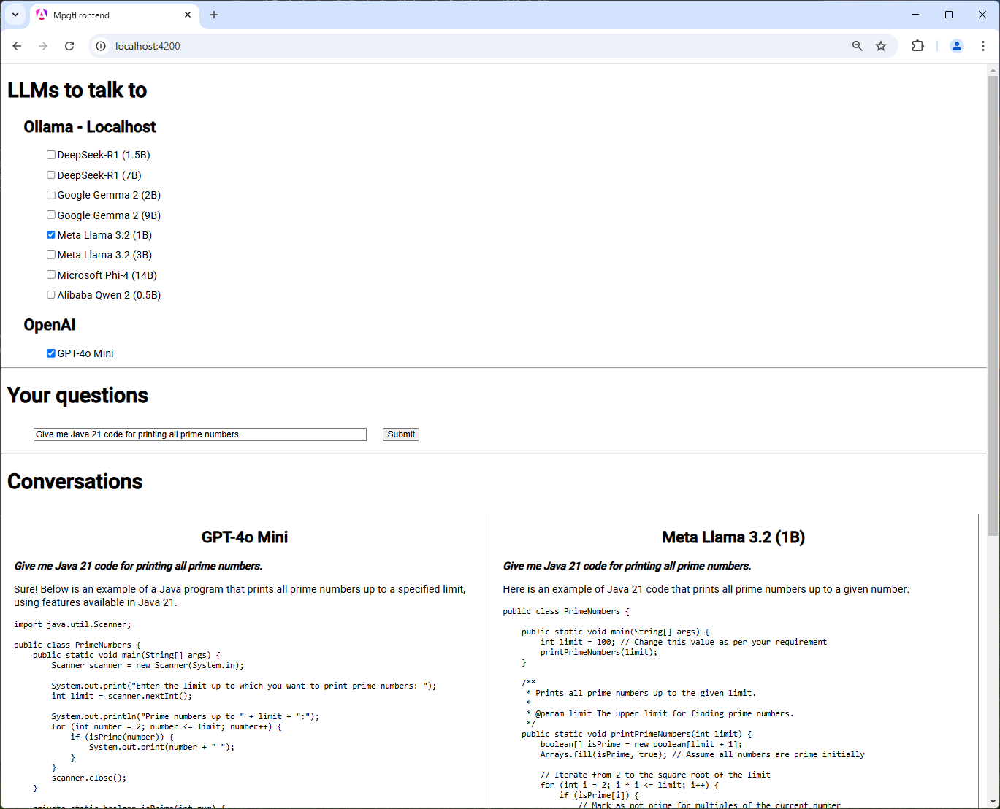

# Overview

## Background

Goal of this project is to create a web application for having parallel conversation with different
AI/LLM models at same time. Usage is comparison of quality in responses from different models.

It was made a side project during my first weeks of employment at adesso when I had some time to 
spare. Motivation for doing this project, instead  of something else, is to improve my Angular
knowledge and do something fun with AI. It can also be used as a reference project to show
how easy it is implement programmatic access to LLMs.

## Status

Project is now on standby due to other assignments. Code is left as is it looked when it was 
functional for the first time, in other words code is a mess. Here is a list of other known 
limitations: <ul>
    <li>There is no packaging or deployment of artifacts.</li>
    <li>Applications does not hold state of conversation so every question will be answered to 
        without considering
        previous question(s). In other words there is no conversation, only prompts.
    <li>There is no streaming of answers. Application will wait for complete answer and then 
        display the entire thing at once.
    <li>UI is extremely simple. For a dummy answer ("...") is the only indication that we are 
        waiting for an answer.</li>
    <li>...</li>
<ul></ul>

Here is a screenshot of application in action:

# Architecture

Architecture consists of three layers:
<ul>
    <li>Frontend web application developed in Angualar. Code is in mgpt folder in this repo.</li>
    <li>Backed with very simple REST API implemented as Springboot app. Code is in root folder of this project.</li>
    <li>LLM "providers". This is not part of git repo so providers can be seen as external dependency to this package.
        Backend supports two types of providers: Ollama and OpenAI.</li>
</ul>

No packaging or deployment of frontend, backend or LLM:s exist. Ollama must be installed and run locally, 
OpenAI account must be setup and API key inserted in code, backend started by running the Springboot 
main class and frontend run through Angular CLI (e.g. "ng serve").

# Setup

Here are the steps required to run the application on your dev computer:
<ol>
    <li>Install and run Ollama. Also make sure you have a number of models downloaded.</li>
    <li>Install Node, NPM and angular CLI.</li>
    <li>Create an OpenAI account with access to at least GPT-4o mini (since it is hard-coded). 
        Insert API key directly in OpenAIClient.java.</li>
    <li>Make sure you have maven installed. Easiest way is to run IntelliJ which has maven bundled.</li>
    <li>Start backend: run java class MgptApplication. Again, the easiest way is to use IntelliJ.</li>
    <li>Start frontend: in any shell, line go to mgpt-frontend folder and run "ng serve".</li>
    <li>Start browser and go to http://localhost:4200. If everything works you should see something 
        similar to screenshot above.</li>
</ol>

# Sprint Plan

Overall plan is to do one sprint per week. This might fail since sales activities will have higher priority.

## Sprint 1

Goals:
<ul>
    <li>Setup Ollama locally and do test prompts to see how/if they differ (proof of value).</li>
    <li>Check what other alternatives there is to do same thing (proof of value)</li>
    <li>Create backend with dummy endpoint that returns fixed response. To setup infrastructure.</li>
    <li>Create frontend with mocked data.</li>
    <li>Make draft architecture and sprint plan.</li>
</ul>

Lessons learned:
<ul>
    <li>Response differ widely between models, both with regard to correctness and verbosity.</li>
    <li>Since the responses differ that much it makes sense to be able to ask single questions to 
        multiple models. This could be good first step to work more iterative.</li>
    <li>It is totally possible to run at least llama-3.2, deepseek-r1 and qwen:0.5b locally at same 
        time time (memory/CPU wise). This is also a good match since they differ alot in behaviour.</li>
    <li>Stream mode would be nice since especially deepseek have long conversions with itself 
        and takes minutes to give complete answer.</li>
    <li>Angular is for single-page application. There is no support for opening a new tab and rendering
        different pages with different URLs.</li>
</ul>

Status: completed.

## Sprint 2

Goals:
<ul>
    <li>Make workflow work end-2-end with local LLMs.</li>
    <li>List of models shall be fetched from backend, which in turn shall fetch them from Ollama API.</li>
    <li>Questions/prompt shall be sent to all (active) LLMs </li>
    <li>Limitations:<ul>
        <li>No session and memory in backend. Follow-up question won't make any sense.</li>
        <li>No streaming. Deepseek will be very hard to use since it chats for minutes.</li>
        <li>Only local Ollama models supported.</li>
        <li>Frontend must be run through "ng serve". No packaging etc</li>
    </ul>
</ul>

Lessons learned:
<ul>
    <li>Response from Ollama is markdown formatted (with possible extensions, I have not found any 
        documentation). It cannot be directly displayed and browser. Workaround is to convert to
        HTML with third-party library and display with help of internalHTML.</li>
    <li>Response time from LLMs is a major obstacle when running everything locally. Especially
        for big models.</li>
    <li>To get a descent UI is also critical. For example, without proper formatting of responses 
        the functionality is barely visible.</li>
    <li>Result shows that this is something that is worth more time!</li>
</ul>

Status: completed.

## Sprint 3

Goals:
<ul>
    <li>Basically wrap up and cut loose ends. Some hard decisions are needed to make the
        functionality clear, without "it is like this because I want to do that it future".</li>
    <li>Examples: add/remove models when checkboxes are selected, add a clear button and a
        submit button so that same question can be asked multiple times. And cleanup model
        names to separate models "family" from size.</li>
    <li>Discuss with students if it is something that they can use as inspiration.</li>
    <li>Stretch: create Open AI free tier account and add as separate "backend".</li>
</ul>

Lessons learned:
<ul>
    <li>Nested div tags is the way to go when designing a UI with space in correct places.</li>
    <li>It still feels like a lottery when trying to design buttons etc and catching events.
        Sometimes Angular specific names can be used, and sometimes names shall have 
        parenthesis (), sometimes both brackets and parenthesis [()]...</li>
    <li>Getting programmatic access to OpenAI is very simple. I created a free-tier accound
        and added OpenAI as provider/family in less than one working day (code is very naive).</li>
</ul>

Status: completed.

